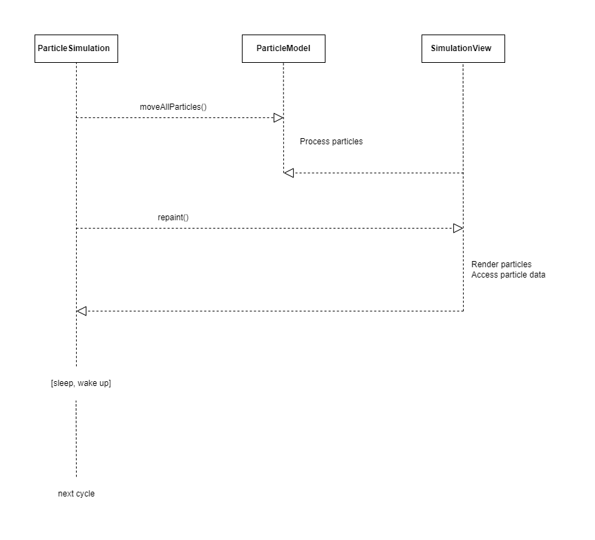
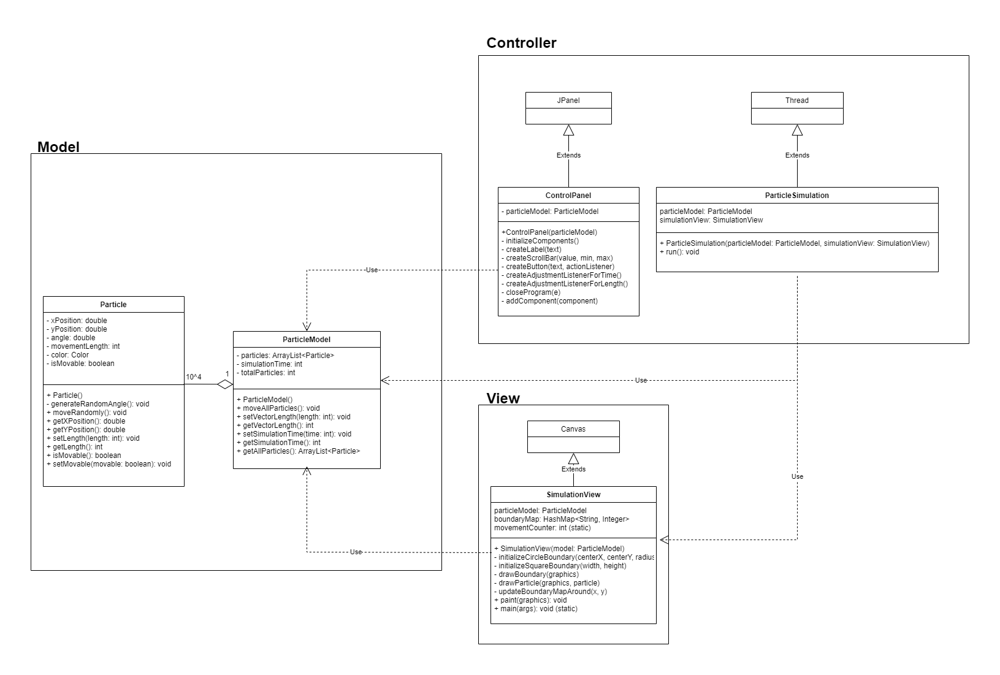

# Brownian Motion Particle Simulation

## Overview

This Java program simulates Brownian motion, a phenomenon where particles in a fluid move randomly due to collisions with surrounding molecules. The code provides a graphical representation of particles undergoing Brownian motion within a defined boundary.

## Brownian Motion

Brownian motion, named after the scientist Robert Brown, is the random motion of particles suspended in a fluid (liquid or gas) resulting from their collision with fast-moving atoms or molecules in the fluid. This motion is characterized by its random and unpredictable nature, which was one of the key pieces of evidence for the existence of atoms and molecules.

## How the Code Simulates Brownian Motion

This program uses a simplified model to simulate Brownian motion:

1. **Particles**: The program represents particles as small objects with positions in a two-dimensional space.

2. **Random Movement**: Each particle undergoes random motion by changing its position in a random direction at regular time intervals.

3. **Boundary**: The particles are confined within a circular boundary.

4. **Control Panel**: The program provides a control panel with two settings:
   - **Change in time**: This setting controls the time interval between particle movements, simulating the effect of collisions with surrounding molecules.
   - **Change in vector length**: This setting controls the length of the movement vector, determining how far a particle moves in each step.

5. **Visualization**: The graphical canvas shows the particles as points moving within the circular boundary. Their random movement mimics Brownian motion.

## Program Structure

- `ParticleSimulation`: The main class responsible for running the simulation in a separate thread, continuously updating particle positions.

- `SimulationView`: This class provides the graphical representation of the simulation and draws the particles on a canvas.

- `Particle`: Defines the behavior of individual particles, including their random movement.
